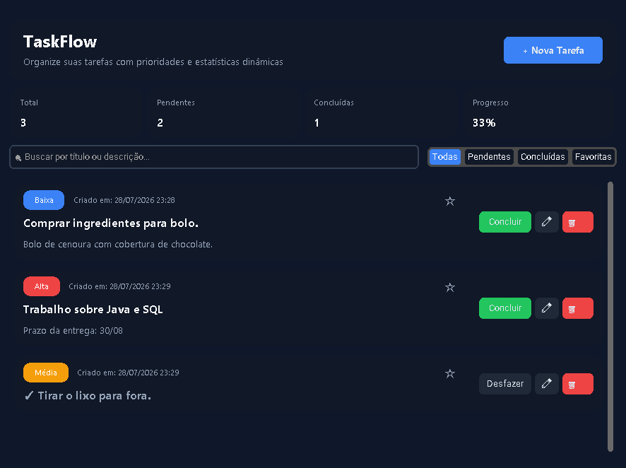

# ⚡ TaskFlow — Gestor de Tarefas Desktop


O **TaskFlow** é uma aplicação desktop de gerenciamento de tarefas (To-Do List) com uma interface moderna, responsiva e suporte completo a operações CRUD. O projeto foi estruturado seguindo o padrão de **Arquitetura em Camadas (Layered Architecture)**, garantindo desacoplamento entre a regra de negócio, a persistência de dados e a interface visual.

---

## 📸 Demonstração da Interface

| Minhas Tarefas (Dashboard) | Modal de Cadastro / Edição |
| :---: | :---: |
|  |  |

---

## ✨ Funcionalidades Principais

* 📋 **CRUD Completo de Tarefas**: Criação, listagem, edição e exclusão de tarefas.
* 🚨 **Gestão de Prioridades**: Marcação de prioridades em níveis (**Alta**, **Média**, **Baixa**) com indicativos visuais coloridos.
* ⭐ **Favoritos & Status**: Sistema para favoritar tarefas e alternar entre pendente e concluído.
* 🔍 **Busca Dinâmica em Tempo Real**: Filtro instantâneo por texto no título ou na descrição conforme o usuário digita.
* 🏷️ **Filtros por Abas**: Navegação rápida entre *Todas*, *Pendentes*, *Concluídas* e *Favoritas*.
* 📊 **Painel de Estatísticas**: Métricas recalculadas em tempo real (Total de Tarefas, Pendentes, Concluídas e Porcentagem de Progresso).
* 🗄️ **Persistência em Banco Relacional**: Armazenamento seguro de dados locais via **SQLite**.
* 📁 **Exportação de Dados**: Funcionalidade para backup local em formato **JSON** ou exportação para planilhas em **CSV**.
* 🖥️ **Interface Modern Dark & Responsiva**: Design escuro construído com CustomTkinter, incluindo barra lateral de navegação e ajuste automático de quebra de linha do texto (*wraplength* dinâmico).

---

## 🏛️ Arquitetura do Projeto

O código-fonte é organizado em camadas bem definidas, promovendo reutilização de componentes e manutenibilidade:

```text
taskflow/
├── data/
│   └── database.py        # Camada de Persistência (SQLite / Conexão e SQL)
├── logic/
│   └── task_manager.py     # Camada de Regras de Negócio (CRUD, Filtros, Estatísticas e Exportação)
├── models/
│   └── task.py            # Modelo de Dados (Data Class Task)
├── ui/
│   ├── components.py      # Componentes reutilizáveis CustomTkinter
│   ├── dashboard.py       # View principal (Dashboard / Minhas Tarefas)
│   └── task_dialog.py     # Pop-up modal para Adicionar e Editar Tarefas
├── app.py                 # Janela Principal, Views Adicionais e Gerenciador de Navegação (Sidebar)
├── config.py              # Configurações globais (Cores, Fontes, Padded/Spacing)
├── main.py                # Ponto de entrada (Entry point) da aplicação
└── requirements.txt       # Dependências do projeto
```

---

## 🛠️ Tecnologias Utilizadas

* **Linguagem**: [Python](https://www.python.org/)
* **Interface Gráfica**: [CustomTkinter](https://github.com/TomSchimansky/CustomTkinter)
* **Banco de Dados**: [SQLite3](https://www.sqlite.org/) *(Módulo nativo)*
* **Formatos de Exportação**: `json` e `csv` *(Módulos nativos)*

---

## 🚀 Como Executar o Projeto

### Pré-requisitos
Certifique-se de ter o **Python 3.10+** instalado em sua máquina.

### Passo a Passo

1. **Clone este repositório:**
   ```bash
   git clone [https://github.com/SEU_USUARIO/taskflow.git](https://github.com/SEU_USUARIO/taskflow.git)
   cd taskflow
   ```

2. **Crie e ative um ambiente virtual (Opcional, mas recomendado):**
   * Linux/macOS:
     ```bash
     python -m venv .venv
     source .venv/bin/activate
     ```
   * Windows:
     ```bash
     python -m venv .venv
     .venv\Scripts\activate
     ```

3. **Instale as dependências:**
   ```bash
   pip install -r requirements.txt
   ```

4. **Execute a aplicação:**
   ```bash
   python main.py
   ```

---

## 📝 Aprendizados e Propósito Educacional

Este projeto foi desenvolvido como um protótipo educacional para praticar conceitos fundamentais do desenvolvimento de software:
* Separação de responsabilidades em arquitetura em camadas.
* Integração de interfaces gráficas desktop com banco de dados SQLite.
* Manipulação de eventos no CustomTkinter para interfaces responsivas.

---

## ✒️ Autor

Desenvolvido por **Julio Ormundo**.

[](https://linkedin.com)
[](https://github.com)
